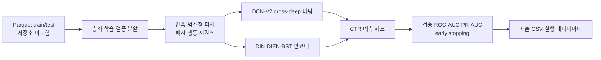

# DCN-V2와 시퀀스 관심 모델을 활용한 CTR 예측

[English](README.md)

> [프로젝트 자세히 보기](PORTFOLIO.ko.md)

정형 피처와 행동 시퀀스로 광고 클릭 확률을 예측하는 실험 저장소입니다. DCN-V2 스타일 cross/deep 네트워크에 DIN·DIEN·BST 시퀀스 인코더를 붙이고, 여러 실행의 요약 메타데이터를 보관합니다.

## 문제와 분석 흐름

사용자·광고 인벤토리·시간·과거 행동 시퀀스에서 클릭 확률을 추정합니다. 학습 경로는 weighted binary cross-entropy로 불균형을 다루고 ROC-AUC·PR-AUC로 모델을 비교합니다.



## 구현한 방식

- 연속형 값은 `float32`로 바꾸고, 범주형은 학습 분할에서 만든 매핑과 OOV 인덱스를 사용합니다.
- 행동 이력은 최대 50개로 자르고 padding한 뒤 262,144개 버킷으로 해시해 임베딩 어휘 크기를 제한합니다.
- `DCN_SEQ_Model`은 CrossNetMix, deep MLP, 선택 가능한 DIN·DIEN·BST 관심 인코더를 결합합니다.
- 학습은 seed 42의 층화 85/15 분할, `BCEWithLogitsLoss(pos_weight=negative/positive)`, AdamW, cosine annealing, AUC 기반 early stopping을 사용합니다.

## 보관된 검증 결과

아래 값은 외부 테스트셋·리더보드 점수가 아니라 저장된 validation metadata입니다. 주요 실행은 전체 학습 데이터와 3 epoch를 기록합니다.

| 실험 | validation ROC-AUC | validation PR-AUC | 근거 |
|---|---:|---:|---|
| DCN-V2 + DIEN | 0.7413 | **0.0792** | `results/dcnv2_dien_meta.json` |
| DCN-V2 + DIN | 0.7402 | 0.0775 | `results/din_dcnv2_meta.json` |
| DCN-V2 + auto-BST | 0.7403 | 0.0783 | `results/dcnv2_auto_bst_meta.json` |
| DCN-V2 + DIEN + DUSIN (full) | **0.7417** | 0.0780 | `results/dcnv2_dien_dusin_full_meta.json` |

ROC-AUC와 PR-AUC의 최고값이 서로 다른 실행에 있으므로 하나의 절대적 우승 모델을 주장하지 않습니다.

## 실행

원본 Parquet이 없으므로 현재 체크아웃만으로 동일 결과를 재현할 수는 없습니다. 호환되는 입력 파일과 패키지를 준비한 뒤 유지되는 CLI를 실행합니다.

```powershell
cd src
python train.py `
  --train_path ..\train.parquet `
  --test_path ..\test.parquet `
  --output_path ..\submit_dcn_seq.csv `
  --meta_path ..\meta_dcn_seq.json `
  --seq_backbone dien
```

입력에는 `clicked` 라벨, `seq` 행동 시퀀스, `ID` 제출 식별자가 필요합니다. `pip install -r requirements.txt`로 import 기반 패키지 목록을 설치하고, 정확한 버전은 별도로 맞춰야 합니다.

## 한계와 문서

원본 데이터·외부 테스트 라벨·리더보드·학습 checkpoint가 없습니다. DUSIN 일부는 노트북 기반 확장 실험이고, `main.py`의 LightGBM 스텁은 `src/train.py`와 다른 경로입니다.

- [포트폴리오 사례 연구](PORTFOLIO.ko.md)
- [프로젝트 리뷰](docs/PROJECT_REVIEW.md)
- [아키텍처](docs/ARCHITECTURE.md)
- [실행 매니페스트](research/RUN_MANIFEST.md)
