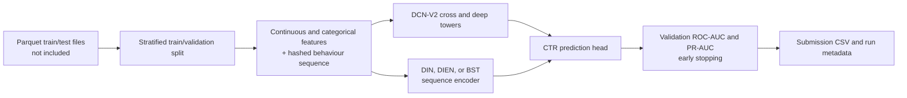

# CTR Prediction with DCN-V2 and Sequence Interest Models

[한국어](README.ko.md)

> [Project details](PORTFOLIO.md)

This repository investigates click-through-rate (CTR) prediction using tabular
features and behavioural sequences. It combines a DCN-V2-style cross/deep
network with DIN, DIEN, or BST sequence backbones, while retaining compact
metadata from several experimental runs.

## Problem

Given user, inventory, temporal, and historical-sequence features, estimate
the probability of an advertisement click. The provided training pipeline
addresses class imbalance with a weighted binary cross-entropy loss and ranks
models using ROC-AUC and PR-AUC.

## Analysis flow



## Implemented approach

- **Feature handling:** continuous values are cast to `float32`; categorical
  values are mapped from the training split with an out-of-vocabulary index.
- **Sequence handling:** parsed item histories are truncated/padded to 50 items
  and hashed into 262,144 buckets to bound embedding vocabulary size.
- **Model:** `DCN_SEQ_Model` combines CrossNetMix layers, a deep MLP tower, and
  a selectable DIN, DIEN, or BST interest encoder.
- **Training:** a stratified 85/15 train/validation split uses seed 42,
  `BCEWithLogitsLoss(pos_weight=negative/positive)`, AdamW, cosine annealing,
  and AUC-based early stopping.

The model implementation is in `src/`; notebooks retain broader experimental
variants, including DUSIN-labelled runs.

## Retained experiment results

The following are saved validation metadata, not external test-set or
leaderboard scores. The retained runs use three epochs and full training data
according to their JSON metadata.

| Experiment | Validation ROC-AUC | Validation PR-AUC | Evidence |
|---|---:|---:|---|
| DCN-V2 + DIEN | 0.7413 | **0.0792** | `results/dcnv2_dien_meta.json` |
| DCN-V2 + DIN | 0.7402 | 0.0775 | `results/din_dcnv2_meta.json` |
| DCN-V2 + auto-BST | 0.7403 | 0.0783 | `results/dcnv2_auto_bst_meta.json` |
| DCN-V2 + DIEN + DUSIN (full) | **0.7417** | 0.0780 | `results/dcnv2_dien_dusin_full_meta.json` |

The highest recorded ROC-AUC and PR-AUC occur in different configurations, so
this repository does not establish a single winner across both metrics.

## Repository layout

```text
.
├── src/
│   ├── data.py                 # Dataset, sequence parsing, and hashing
│   ├── models.py               # DCN-V2-style and sequence model components
│   └── train.py                # CLI training, validation, and output metadata
├── notebooks/                  # Exploratory and extended model experiments
├── results/                    # Retained JSON run metadata
├── prior-research/             # Background material
└── main.py                     # Standalone LightGBM feature-engineering stub
```

## How to run

The raw Parquet files are intentionally absent, so exact result reproduction
cannot be verified from this checkout alone. With compatible source files and
the required Python packages installed, run the supported CLI from `src/`:

```powershell
cd src
python train.py `
  --train_path ..\train.parquet `
  --test_path ..\test.parquet `
  --output_path ..\submit_dcn_seq.csv `
  --meta_path ..\meta_dcn_seq.json `
  --seq_backbone dien
```

Expected input columns include `clicked` (label), `seq` (behaviour sequence),
and `ID` (submission identifier); other columns are partitioned by the script.
Install the import-derived package list with `pip install -r requirements.txt`.
Exact package versions were not recorded. Shared defaults are documented in
`src/config.py`; see `research/RUN_MANIFEST.md` for the refactor boundary.

## Limitations

- No raw data, external test labels, leaderboard result, or trained checkpoint
  is versioned in the repository.
- The current CLI implements DIN/DIEN/BST selection; some retained DUSIN runs
  are notebook-based experimental variants.
- The standalone `main.py` is a LightGBM feature-engineering stub and is not
  the same end-to-end path as `src/train.py`.

## Documentation

- [Portfolio case study](PORTFOLIO.md)
- [Project review](docs/PROJECT_REVIEW.md)
- [Architecture](docs/ARCHITECTURE.md)
- [CV bullets](docs/CV_BULLETS.md)
- [Run manifest](research/RUN_MANIFEST.md)
