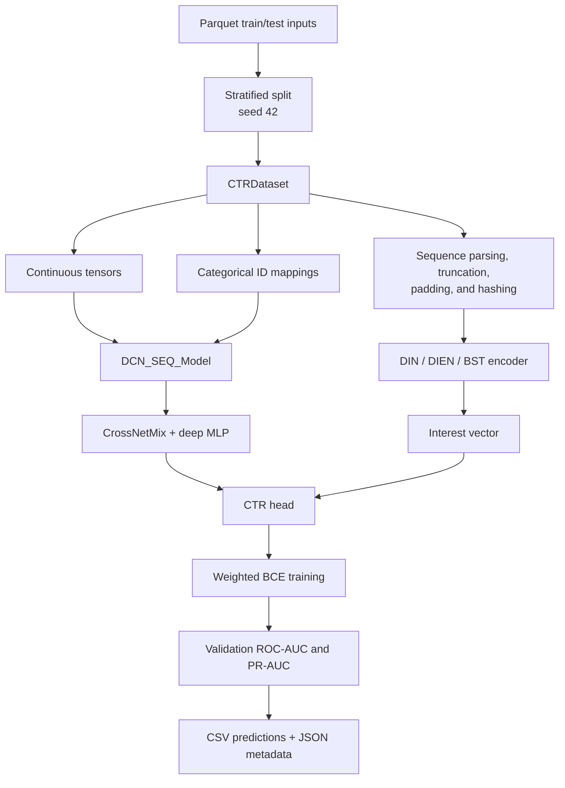

# Architecture

## Components

| Path | Responsibility |
|---|---|
| `src/data.py` | Parses heterogeneous sequence strings, hashes IDs, and exposes PyTorch datasets. |
| `src/models.py` | Defines CrossNetMix, DIN, DIEN, BST, and the combined CTR model. |
| `src/train.py` | Splits data, builds features/model, trains, evaluates, and saves output metadata. |
| `src/config.py` | Preserves and centralizes default experiment settings. |
| `notebooks/` | Retains experimental variants and executed outputs. |
| `results/` | Stores compact metadata for recorded validation runs. |
| `main.py` | Contains a separate LightGBM stub, not the supported deep-learning CLI path. |

## Data and evaluation boundary

`src/train.py` expects train/test Parquet inputs. Training labels are required
only in the train input. The validation partition is drawn from the training
file with `train_test_split(..., test_size=0.15, random_state=42, stratify=...)`.
The test input receives predictions, but its labels and external evaluation are
not present in this repository.

Both `python src/train.py` and `python -m src.train` are supported. The former
preserves the legacy direct-script workflow; the latter treats `src` as a
package.
